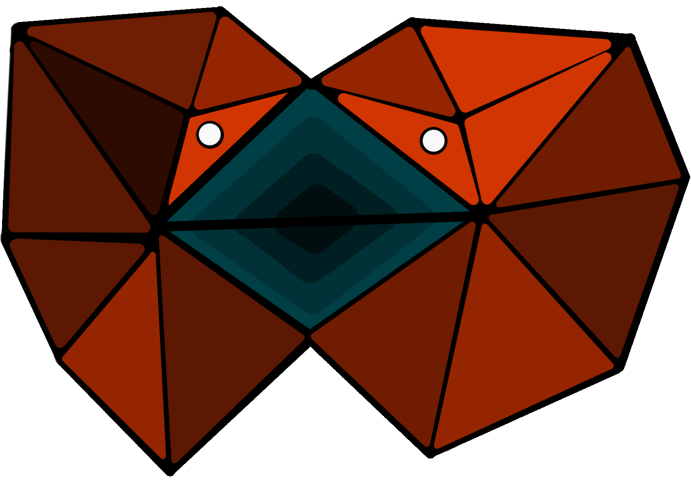

[](https://github.com/flippy-software-package/flippy/actions/workflows/coverage.yml)


[](https://github.com/flippy-software-package/flippy/releases)
[](https://github.com/flippy-software-package/flippy/blob/master/LICENSE)
[](mailto:flippy@mailbox.org)
# flippy

 

c++ package for dynamically triangulated membrane simulations.

# Gallery
|                                                                                                                                                                |                                                                                                                                                                       |
|:--------------------------------------------------------------------------------------------------------------------------------------------------------------:|:---------------------------------------------------------------------------------------------------------------------------------------------------------------------:|
|                         | |
|  |                            |

# Support
Flippy is still in active development and the documentation is almost non-existent, but I try my best to reply to e-mails and provide support for scientists who want to use flippy.
### for questions about general usage
please use the support email [](mailto:flippy@mailbox.org).
### for bugfixes 
please create an [issue](https://github.com/flippy-software-package/flippy/issues).
### for feature requests
again the [issues](https://github.com/flippy-software-package/flippy/issues) page can be used but be aware that new features will be slow to come.

# How to get it

*flippy* is a headers only library, so all you need to is to download the `flippy` sub-folder and copy it into your project.

Or if you prefer using a single header file you can just download the [flippy.hpp](https://raw.githubusercontent.com/flippy-software-package/flippy/master/single_header_flippy/flippy.hpp) header from the `single_header_flippy` folder.

# Documentation
Easiest way to get started with flippy are the demo projects. These are located in subfolders of the [`demo`](https://github.com/flippy-software-package/flippy/tree/master/demo) folder. Each sub-folder contains a readme like this one, explaining how to set up a project and what to expect from it. 

Automatically generated code [documentation](https://github.com/flippy-software-package/flippy/wiki/Documentation) over on the [wiki](https://github.com/flippy-software-package/flippy/wiki).

# Examples of usage

This is a simple example of a monte carlo update of a spherical triangulation in under 100 lines. The code will run for several seconds to several minutes depending on the strength of your cpu and will produce a biconcave shape, i.e. something resembling a red blood cell.

A detailed description on how to execute demo codes can be found in the [`demo/README.md`](https://github.com/flippy-software-package/flippy/tree/master/demo) file. And a detailed description of how this particular demo works can be found in the [`demo/biconcave_shapes_MC/README.md`](https://github.com/flippy-software-package/flippy/tree/master/demo/biconcave_shapes_MC) file.

This code saves two data files in the folder where the binary file will be executed, under the names `test_run_init.json` and `test_run_final.json` which are full snapshots of the initial and final configurations.

This code can be found in the sub-folder `demo/biconcave_shapes_MC` together with a python script that visualizes the data, and a simple `CMake` file that can be used to build the code.

```cpp
//demo/biconcave_shapes_MC/main.cpp

#include <random> // needed for random displacement generation
#include <vector> // need for std::vector
#include <iostream> // needed for std::cout
#include "flippy.hpp"

double sphere_vol(double R){return 4./3. * M_PI *R*R*R;}
double sphere_area(double R){return 4. * M_PI *R*R;}

struct EnergyParameters{double kappa, K_V, K_A, V_t, A_t;};

// This is the energy function that is used by flippy's built in updater to decide if a move was energetically favourable or not
double surface_energy([[maybe_unused]]fp::Node<double, int> const& node,
                      fp::Triangulation<double, int> const& trg,
                      EnergyParameters const& prms){
    double V = trg.global_geometry().volume;
    double A = trg.global_geometry().area;
    double dV = V-prms.V_t;
    double dA = A-prms.A_t;
    double energy = prms.kappa*trg.global_geometry().unit_bending_energy +
                    prms.K_V*dV*dV/prms.V_t + prms.K_A*dA*dA/prms.A_t;
    return energy;
}

int main(){
    int n_triang = 7; // triangulation iteration number of nodes N_node=12+30*n+20*n*(n-1)/2 where n is the same as n_trng
    double l_min = 2;
    double R = l_min/(2*sin(asin(1./(2*sin(2.*M_PI/5.)))/(n_triang+1.))); // estimate of a typical bond length in the initial triangulation and then create a sphere such that the initial bond length are close to minimal. This formula is derived from equidistant subtriangulation of an icosahedron, where geodesic distances are used as a distance measure.
    double l_max = 2.*l_min; // if you make l_max closer to l_min bond_flip acceptance rate will go down
    double r_Verlet = 2*l_max;
    EnergyParameters prms{.kappa=10 /*kBT*/,
                          .K_V=100 /*kBT/area*/, .K_A=1000 /*kBT/volume*/,
                          .V_t=0.6*sphere_vol(R), .A_t=sphere_area(R)};
    double linear_displ=l_min/8.; // side length of a voxel from which the displacement of the node is drawn
    int max_mc_steps=1e5; // max number of iteration steps (depending on the strength of your cpu, this should take anywhere from a couple of seconds to a couple of minutes

    std::random_device random_number_generator_seed;
    std::mt19937 rng(random_number_generator_seed()); // create a random number generator and seed it with current time

    // All the flippy magic is happening on the following two lines
    fp::Triangulation<double, int> guv(n_triang, R, r_Verlet);
    fp::MonteCarloUpdater<double, int, EnergyParameters, std::mt19937, fp::SPHERICAL_TRIANGULATION> mc_updater(guv, prms, surface_energy, rng, l_min, l_max);

    fp::vec3<double> displ{}; // declaring a 3d vector (using flippy's built in vec3 type) for a later use as a random direction vector
    std::uniform_real_distribution<double> displ_distr(-linear_displ, linear_displ); //define a distribution from which the small displacements in x y and z directions will be drawn

    guv.scale_node_coordinates(1, 1, 0.8); // squish the sphere in z direction to break the initial symmetry. This speeds up the convergence to a biconcave shape greatly

    fp::Json data_init = guv.make_egg_data();
    fp::json_dump("test_run_init", data_init);  // ATTENTION!!! this file will be saved in the same folder as the executable

    std::vector<int> shuffled_ids;
    shuffled_ids.reserve(guv.size());
    for(auto const& node: guv.nodes()){ shuffled_ids.push_back(node.id);} //create a vector that contains all node ids. We can shuffle this vector in each MC step, to iterate randomly through the nodes

    for(int mc_step=0; mc_step<max_mc_steps; ++mc_step){
        for (int node_id: shuffled_ids) { // we first loop through all the beads and move them
            displ = {displ_distr(rng), displ_distr(rng), displ_distr(rng)};
            mc_updater.move_MC_updater(guv[node_id], displ); // guv[node_id] returns the node which has id=node_id
        }
        std::shuffle(shuffled_ids.begin(), shuffled_ids.end(), rng); // then we shuffle the bead_ids
        for (int node_id: shuffled_ids) { // then we loop through all of them again and try to flip their bonds
            mc_updater.flip_MC_updater(guv[node_id]);
        }
    }

    // MonteCarloUpdater counts the number of accepted and rejected moves, and it distinguishes between if a rejectio occurred because of the energy or the bond length constraint.
    // We can use this to print a simple statistics here. This will help us decide if our displacement size is too large for example.
    std::cout<<"percentage of failed moves: "<<(mc_updater.move_back_count() + mc_updater.bond_length_move_rejection_count())/((long double)mc_updater.move_attempt_count())<<'\n';
    std::cout<<"percentage of failed flips: "<<(mc_updater.flip_back_count() + mc_updater.bond_length_flip_rejection_count())/((long double)mc_updater.flip_attempt_count())<<'\n';

    fp::Json data_final = guv.make_egg_data();
    fp::json_dump("test_run_final", data_final);  // ATTENTION!!! this file will be saved in the same folder as the executable

    return 0;
}
```

# Versioning

Crrent version [](https://github.com/flippy-software-package/flippy/releases) is the first stable release. No API breaking changes are expected in near future, and if they occur they will be preceded by deprecation warnings in previous versions. 

flippy's version numbers follow [Semantic Versioning](https://semver.org/) guidelines.

## changes in [](https://github.com/flippy-software-package/flippy/releases)

### breaking changes
- renamed `global_geometry.dA_K2` and `node.scaled_curvature_energy` to `unit_bending_energy`
    - `unit_bending_energy` also differs from `scaled_curvature_energy` by a factor of `0.5`
- removed `debug_utils` from flippy. This functionality was unrelated to membrane simulations and simply offered additional printing and timing capabilities.
- Printing and timing utilities were removed form the `utils.hpp` header, since these tools are not related to membrane simulations and should not be maintained together with flippy.
    - these utilities can be found in their own [repository](https://github.com/gdadunashvili/code_utils) now.
### new features
- none
### bugfixes
- removed default constructor from `MonteCarloUpdater` since it was implicitly deleted anyway.
- changed update counters types in `MonteCarloUpdater` to long instead of Index to avoid integer overflow.
- double check if the stdlib defines M_PI and define it if not.
- count of moves and flips is saved in a `unsigned long` variable, by the `MonteCarloUpdater` to avoid overflow for even very long simulations.

## well tested part of the api

- spherical triangulation
- vec3
- nodes
- debug utils / utils
- MonteCarloUpdater

## new and poorly tested

- planar triangulation

## coming soon

- tubular triangulation

## could be implemented at some point

- solid bodies
    - other objects that the triangulations could interact with
- force based updater
    - a utility class like MonteCarloUpdater, which uses force balance functions to update node positions

# licence

*flippy* is under MIT License, which means you can do pretty much anything with it. For more information read the `LICENCE` file.
