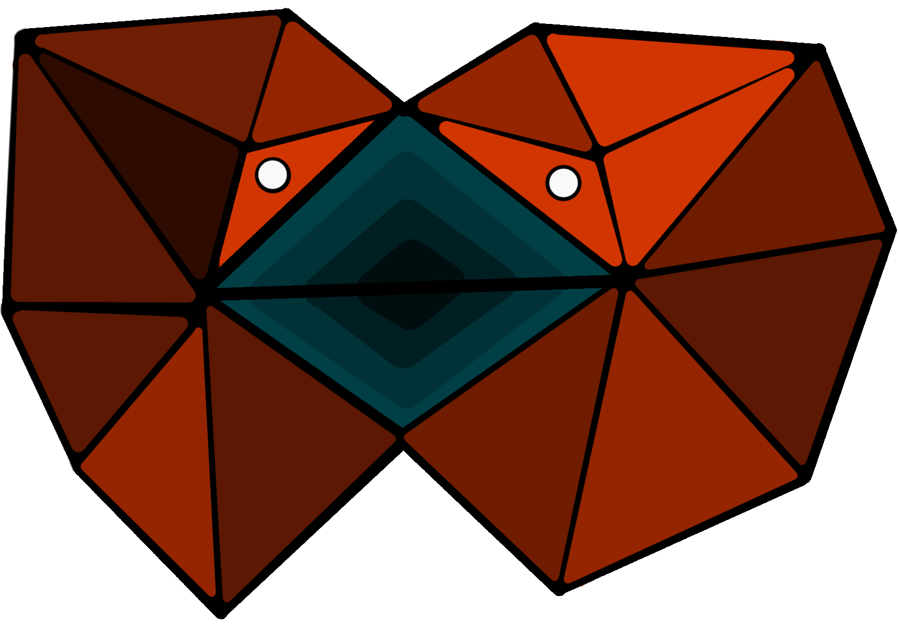

[](https://github.com/flippy-software-package/flippy/actions/workflows/coverage.yml)


[](https://github.com/flippy-software-package/flippy/releases)
[](https://github.com/flippy-software-package/flippy/blob/master/LICENSE)
[](mailto:flippy@mailbox.org)
# *flippy*



c++ package for dynamically triangulated membrane simulations.

# Gallery
|                                                                                                                                                                |                                                                                                                                                                       |
|:--------------------------------------------------------------------------------------------------------------------------------------------------------------:|:---------------------------------------------------------------------------------------------------------------------------------------------------------------------:|
|                         | |
|  |                            |

# Support
*flippy* is still in active development but has the first stable release. And a full public [API documentation](https://flippy-software-package.github.io/flippy). I am actively working on flippy and welcome pull requests and bug reports.
I will also consider feature requests, but in that case, please provide a use case.
### for questions about general usage
please use the support email [](mailto:flippy@mailbox.org).
### for bugfixes
please create an [issue](https://github.com/flippy-software-package/flippy/issues).
### for feature requests
again the [issues](https://github.com/flippy-software-package/flippy/issues) page can be used, but be aware that new features will be slow to come.

# How to get it

*flippy* is a header-only library, so all you need to do is to download the `flippy` sub-folder and copy it into your project.

# Documentation
*flippy*'s public API is fully [documented](https://flippy-software-package.github.io/flippy). However, if you have never used *flippy* before, you might want to start with the demo projects. These are located in sub-folders of the [`demo`](https://github.com/flippy-software-package/flippy/tree/master/demo) folder. Each sub-folder contains a readme like this one, explaining how to set up a project and what to expect.

Automatically generated code [documentation](https://github.com/flippy-software-package/flippy/wiki/Documentation) over on the [wiki](https://github.com/flippy-software-package/flippy/wiki).
# Citing flippy
If you use *flippy* in your research, please cite the [arXiv preprint](https://arxiv.org/abs/2303.12305) as follows:
```bibtex
@article{dadunashvili2023flippy,
    title={flippy: User friendly and open source framework for lipid membrane simulations},
    author={George Dadunashvili and Timon Idema},
    year={2023},
    eprint={2303.12305},
    archivePrefix={arXiv},
    primaryClass={cond-mat.soft}
}
```

# Examples of usage

This is a simple example of a Monte Carlo update of a spherical triangulation in under 100 lines. The code will run for several seconds to several minutes, depending on the strength of your CPU, and will produce a biconcave shape, i.e., something resembling a red blood cell.

A detailed description of how to execute demo codes can be found in the [`demo/README.md`](https://github.com/flippy-software-package/flippy/tree/master/demo) file. And a detailed description of how this particular demo works can be found in the [`demo/biconcave_shapes_MC/README.md`](https://github.com/flippy-software-package/flippy/tree/master/demo/biconcave_shapes_MC) file.

This code saves two data files in the folder where the binary file will be executed, under the names `test_run_init.json` and `test_run_final.json`, which are full snapshots of the initial and final configurations.

This code can be found in the sub-folder `demo/biconcave_shapes_MC` together with a python script that visualizes the data and a simple `CMake` file that can be used to build the code.

```cpp
//demo/biconcave_shapes_MC/main.cpp

#include "flippy.hpp"
#include <iostream> // needed for std::cout
#include <random>   // needed for random displacement generation and node index shuffling
#include <vector>   // need for std::vector

fp::Real sphere_vol(fp::Real R) { return fp::Real(4. / 3.) * fp::PI * R * R * R; }
fp::Real sphere_area(fp::Real R) { return fp::Real(4.) * fp::PI * R * R; }

struct EnergyParameters {
    fp::Real kappa, K_V, K_A, V_t, A_t;
};

// This is the energy function that is used by flippy's built-in updater to decide if a move was energetically favorable
// or not
fp::Real surface_energy(const fp::Node               &node,
                        const fp::Triangulation      &trg,
                        const EnergyParameters       &p,
                        const std::vector<fp::Index> &changed_neighbourhood) {
    fp::Real V         = trg.global_geometry().volume;
    fp::Real A         = trg.global_geometry().area;
    fp::Real dV        = V - p.V_t;
    fp::Real dA        = A - p.A_t;
    fp::Real E_bending = fp::node_unit_bending_energy(node);
    for (fp::Index changed_node_id : changed_neighbourhood) {
        E_bending += fp::node_unit_bending_energy(node);
    }

    fp::Real energy = (p.kappa * E_bending) + (p.K_V * dV * dV / p.V_t) + (p.K_A * dA * dA / p.A_t);
    return energy;
}

#include "../benchmarks/external/code_utils.hpp" //ToDo Remove before prod

int main() {
    cutils::Timer t;
    int           n_triang =
        7; // triangulation iteration number of nodes N_node=12+30*n+20*n*(n-1)/2 where n is the same as n_trng
    fp::Real l_min = 2;
    fp::Real R =
        l_min /
        (2 * sin(asin(1. / (2 * sin(2. * M_PI / 5.))) / (n_triang + 1.))); // estimate of a typical bond length in the
    // initial triangulation and then create a sphere such that the initial bond length is close to minimal. This
    // formula is derived from the equidistant sub-triangulation of an icosahedron, where geodesic distances are used as
    // a distance measure.
    fp::Real         l_max    = 1.8 * l_min; // if you make l_max closer to l_min bond_flip acceptance rate will go down
    fp::Real         r_Verlet = 2 * l_max;
    fp::Real         red_vol  = 0.6;
    EnergyParameters prms{.kappa = 10 /*kBT*/,
                          .K_V   = 100 /*kBT/area*/,
                          .K_A   = 1000 /*kBT/volume*/,
                          .V_t   = red_vol * sphere_vol(R),
                          .A_t   = sphere_area(R)};
    fp::Real linear_displ = l_min / 18.; // side length of a voxel from which the displacement of the node is drawn
    int max_mc_steps = 2e5; // max number of iteration steps (depending on the strength of your CPU, this should take
                            // anywhere from a couple of seconds to a couple of minutes

    std::random_device random_number_generator_seed;
    std::mt19937       rng(
        random_number_generator_seed()); // create a random number generator and seed it with the current time

    // All the flippy magic is happening on the following two lines
    fp::Triangulation                                     guv(n_triang, R, r_Verlet);
    fp::MonteCarloUpdater<EnergyParameters, std::mt19937> mc_updater(guv, prms, surface_energy, rng, l_min, l_max);

    fp::vec3<fp::Real> displ{}; // declaring a 3d vector (using flippy's built in vec3 type) for later use as a random
    // direction vector
    std::uniform_real_distribution<fp::Real> displ_distr(-linear_displ, linear_displ); // define a distribution from
    // which the small displacements in x y and z directions will be drawn

    guv.scale_node_coordinates(1, 1, 0.85); // squish the sphere in the
    // z-direction to break the initial symmetry. This speeds up the convergence to a biconcave shape greatly.

    fp::Json data_init = guv.make_egg_data();
    fp::json_dump("test_run_init",
                  data_init); // ATTENTION!!! this file will be saved in the same folder as the executable

    std::vector<unsigned int> shuffled_ids;
    shuffled_ids.reserve(guv.size());
    for (const auto &node : guv.nodes()) {
        shuffled_ids.push_back(node.id);
    } // create a vector that contains all node ids. We can shuffle this vector in each MC step to iterate randomly
      // through the nodes

    for (int mc_step = 0; mc_step < max_mc_steps; ++mc_step) {
        for (unsigned int node_id : shuffled_ids) { // we first loop through all the beads and move them
            displ = {displ_distr(rng), displ_distr(rng), displ_distr(rng)};
            mc_updater.move_MC_updater(guv[node_id], displ); // guv[node_id] returns the node which has id=node_id
        }
        std::shuffle(shuffled_ids.begin(), shuffled_ids.end(), rng); // then we shuffle the bead_ids
        for (unsigned int node_id :
             shuffled_ids) { // then we loop through all of them again and try to flip their bonds
            mc_updater.flip_MC_updater(guv[node_id]);
        }
    }

    // MonteCarloUpdater counts the number of accepted and rejected moves, distinguishing whether a rejection occurred
    // because of the energy or the bond length constraint. We can use this to print simple statistics here. For
    // example, this will help us decide if our displacement size is too large.
    std::cout << "percentage of failed moves: "
              << (mc_updater.move_back_count() + mc_updater.bond_length_move_rejection_count()) /
                     ((fp::Real)mc_updater.move_attempt_count())
              << '\n';
    std::cout << "percentage of failed flips: "
              << (mc_updater.flip_back_count() + mc_updater.bond_length_flip_rejection_count()) /
                     ((fp::Real)mc_updater.flip_attempt_count())
              << '\n';

    fp::Json data_final = guv.make_egg_data();
    fp::json_dump("test_run_final",
                  data_final); // ATTENTION!!! this file will be saved in the same folder as the executable

    return 0;
}

```

# Versioning

Current version [](https://github.com/flippy-software-package/flippy/releases) is the first stable release. No API-breaking changes are expected in the near future, and if they occur, they will be preceded by deprecation warnings in previous versions.

*flippy*'s version numbers follow [Semantic Versioning](https://semver.org/) guidelines.

## changes in [](https://github.com/flippy-software-package/flippy/releases)

### breaking changes
- renamed `global_geometry.dA_K2` and `node.scaled_curvature_energy` to `unit_bending_energy`
    - `unit_bending_energy` also differs from `scaled_curvature_energy` by a factor of `0.5`
- removed `debug_utils` from *flippy*. This functionality was unrelated to membrane simulations and simply offered additional printing and timing capabilities.
- Printing and timing utilities were removed from the `utils.hpp` header since these tools are unrelated to membrane simulations and should not be maintained together with flippy.
    These utilities can now be found in their own [repository](https://github.com/gdadunashvili/code_utils).
- restricted `fp::IndexingNumber` concept to only positive integers.
### new features
- none
### bugfixes
- removed the default constructor from `MonteCarloUpdater` since it was implicitly deleted anyway.
- changed update counters types in `MonteCarloUpdater` too long instead of Index to avoid integer overflow.
- double-check if the `stdlib` defines M_PI and define it if not.
- count of moves and flips is saved in an `unsigned long` variable by the `MonteCarloUpdater` to avoid overflow for even very long simulations.

## well-tested part of the API

- spherical triangulation
- vec3
- nodes
- debug utils/utils
- MonteCarloUpdater

## new and poorly tested

- planar triangulation

## coming soon

- tubular triangulation

## could be implemented at some point

- solid bodies
    - other objects that the triangulations could interact with
- force-based updater
    - a utility class like MonteCarloUpdater, which uses force balance functions to update node positions

# license

*flippy* is under MIT License, meaning you can do almost anything with it. For more information, read the `LICENCE` file.
